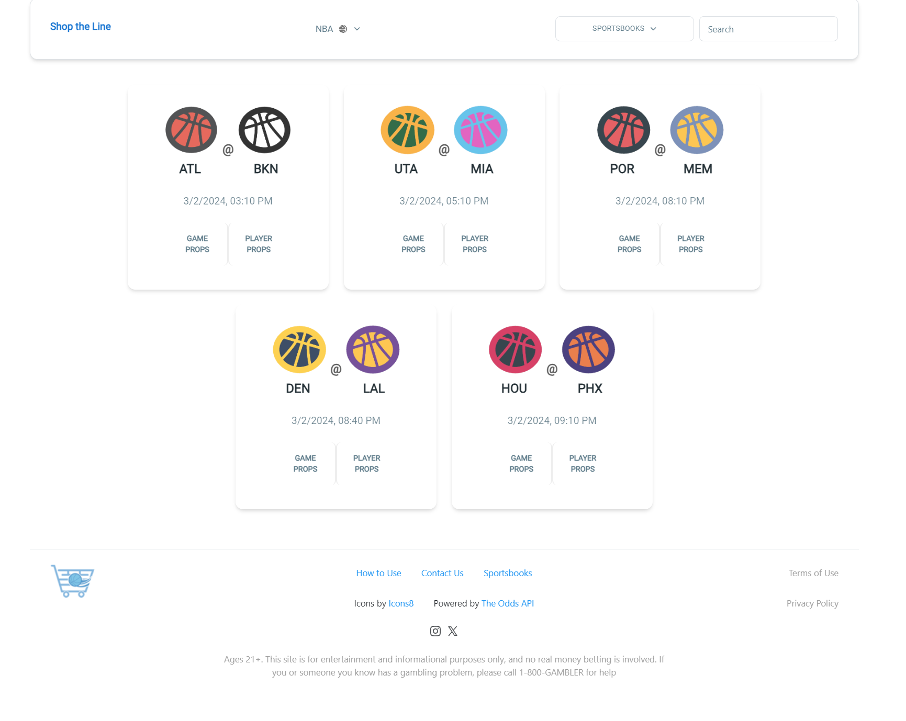

# Shop the Line

Nextjs React App (Javascript, HTML, CSS) that allows the user to view various upcoming sports matches and the betting odds from established bookmakers (DraftKings, Fanduel, William Hill, etc) in the US. A user can monitor the odds of props they're interested in to see which sportsbooks are offering the most favorable odds. Currently supports NFL, NBA, NHL, MLB, NCAAF & NCAAB games.

The application leverages serverless AWS Lambda functions for handling external api calls, Redis for in-memory caching, and Sentry for error logging. 

This project was bootstrapped with [`create-next-app`](https://github.com/vercel/next.js/tree/canary/packages/create-next-app).

## Website

The application is currently deployed with Netlify [here](https://master--stunning-belekoy-7251e6.netlify.app/)

## Images

## Credits

This project utilizes [The Odds API](https://the-odds-api.com/)

State Icons & Medal Icon by [Icons8](https://icons8.com)

